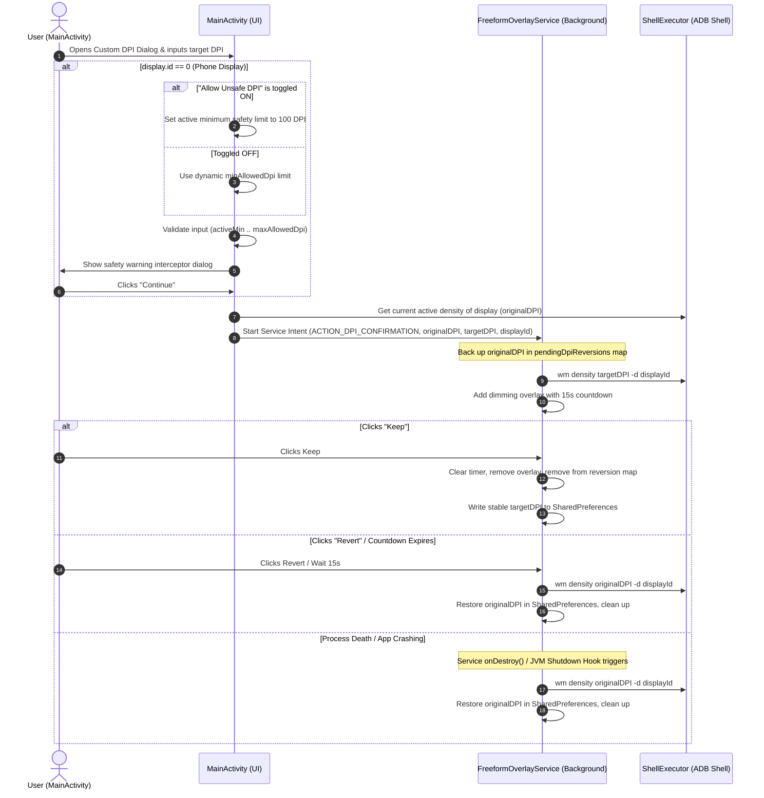

# Implementation Plan — Display Density (DPI) Overhaul & Safety Guard System (Updated)

This plan details the design and architecture for a complete overhaul of the Display Density (DPI) settings system in FreeformShell. It introduces preset buttons, custom input, phone-display warning dialogs, and a universal Windows-style confirmation countdown overlay with robust auto-reversion.

Based on feedback:
- **Presets focus heavily on scaling down the UI with 160 DPI as the ultra-compact baseline**: Desktop shell users seek high information density. We set the lowest preset to **160 DPI** (Android baseline mdpi), which scales a 1080p screen to a highly productive 1080dp width, followed by 240, 320, 360, Default, and 480 DPI presets.
- **Safety limits are dynamically calculated for the phone display** based on screen parameters.
- **Secondary displays are completely unrestricted**.
- **An "Allow Unsafe Extreme DPI" toggle is integrated into the Custom DPI Dialog** to allow technical users to bypass normal min-density safety boundaries down to a flat `100 DPI`.

---

## User Review Required

Please review the planned features and core technical mechanisms below to verify if they match your expectations.

### Key Features
1. **Interactive Presets & Custom Input UI (Skued for Scaling Down)**:
   - Replaces the legacy DPI slider in `SafeAreaScreen` with a horizontal scrolling bar of preset chips/buttons.
   - Presets focus on **scaling down** (lower DPI values to pack more content on screen) relative to the default density:
     - **`160 DPI`** (Ultra Compact / Desktop baseline — gives a full 1080dp canvas on 1080p screens!)
     - **`240 DPI`** (Very Compact)
     - **`320 DPI`** (Compact / Large tablet view)
     - **`360 DPI`** (Medium-Compact)
     - **`[Physical Density] (Default)`** (Baseline hardware physical DPI, e.g., 420 or 440)
     - **`480 DPI`** (Large / Scaled Up)
   - Label whichever button matches the physical density as `"(Default)"`. Highlight the currently active DPI with primary colors and a thicker border.
   - Include an outlined **Custom DPI** button with an edit icon that prompts for keyboard input.

2. **Built-in Screen Safety Interceptor & Dynamic Bounds**:
   - For the **built-in screen** (`display.id == 0`), any change will show a warning: *"Changing display density (DPI) on your phone's built-in display can cause UI glitches, system crashes, or soft-bricking if set to an incompatible value. Are you sure you want to continue?"*
   - **Dynamic Safety Limits**: Rather than hardcoding bounds (like 240–600), we calculate bounds dynamically based on physical screen parameters:
     - **Resolution-based DP width bounds**: To prevent UI elements from becoming too small (which happens if width in DP > 1000dp) or too large (which happens if width in DP < 320dp), we define limits relative to the screen's smaller dimension `minDimension = min(width, height)`.
       - `minDpiFromDp = (minDimension * 160) / 1000`
       - `maxDpiFromDp = (minDimension * 160) / 320`
     - **Hardware Ratio bounds**: Keep the DPI between 50% and 150% of the screen's physical density.
       - `minDpiFromPhys = physicalDpi * 0.5`
       - `maxDpiFromPhys = physicalDpi * 1.5`
     - **Unified Dynamic Limits**:
       - `minAllowedDpi = maxOf(minDpiFromDp.toInt(), (physicalDensity * 0.5).toInt()).coerceAtLeast(160)`
       - `maxAllowedDpi = minOf(maxDpiFromDp.toInt(), (physicalDensity * 1.5).toInt()).coerceAtMost(800)`
   - **Secondary Displays**: No strict safety bounds are enforced. The warning dialog is bypassed entirely, making external monitors immediately configurable.

3. **"Allow Unsafe Extreme DPI" Developer Override**:
   - In the Custom DPI Input Dialog, we add a toggle Switch/Row below the text input field: **"Allow Unsafe Extreme DPI (Min 100)"**.
   - When **disabled** (default): Normal dynamic safety bounds (`minAllowedDpi` to `maxAllowedDpi`) are strictly enforced.
   - When **enabled**: The minimum acceptable DPI limit is lowered dynamically to **100 DPI**. If checked, a subtle warning label appears: *"⚠️ Warning: Low DPI settings make elements extremely tiny. Keep confirmation dialog accessible."*
   - If user inputs a value outside the active range (either `minAllowedDpi..maxAllowedDpi` or `100..maxAllowedDpi` depending on the toggle state), the dialog blocks submission and shows an active validation error.

4. **Universal Windows-Style Confirmation Overlay**:
   - Applies to **any display** (built-in and external).
   - Once a new DPI is applied, the background service overlays a floating centered card: *"Keep these display settings? Reverting to previous settings in 15 seconds..."*
   - Dims the background by **50%** (`FLAG_DIM_BEHIND` and `dimAmount = 0.5f`) for high contrast, deep focus, and a premium OS-integrated appearance.
   - Employs a **15-second countdown timer**. If the user clicks **Revert** or the timer expires, the screen immediately reverts to the pre-transaction active DPI.

5. **Bulletproof Auto-Reversion & Crash-Safety**:
   - If the user goes home, locks the device, or switches to another app, the floating overlay (being a system-level overlay) remains visible on top of everything.
   - If they swipe the app away from Recents (killing the activity), the background overlay remains fully active since it is managed by the foreground service.
   - If the app/service is stopped, crashed, or killed during a pending confirmation, both the service's `onDestroy()` and a **JVM Shutdown Hook** instantly execute a synchronous shell command to revert the display back to the original density. This acts as a robust recovery shield preventing device soft-lock.

---

## Technical Details & Architecture



---

## Proposed Changes

### 🟢 `MainActivity.kt`
#### [MODIFY] [MainActivity.kt](file:///g:/Ai/FreeformShell/app/src/main/java/com/example/freeformshell/MainActivity.kt)

1. **Remove Old DPI Slider**:
   - Remove legacy slider layout in `SafeAreaScreen`.

2. **DPI Queries & Dynamic Bounds Calculation**:
   - In `SafeAreaScreen`, add a `LaunchedEffect(selectedIdx)` to execute:
     - `wm density -d ${display.id}` to fetch both the active overriding DPI and the physical default DPI.
     - Store these as states: `var physicalDensity by remember { mutableStateOf(420) }` and `var activeDensity by remember { mutableStateOf(420) }`.
   - Calculate safe bounds dynamically:
     ```kotlin
     val minDimension = minOf(display.width, display.height)
     val minDpiFromDp = (minDimension * 160) / 1000
     val maxDpiFromDp = (minDimension * 160) / 320
     val minAllowedDpi = maxOf(minDpiFromDp, (physicalDensity * 0.5).toInt()).coerceAtLeast(160)
     val maxAllowedDpi = minOf(maxDpiFromDp, (physicalDensity * 1.5).toInt()).coerceAtMost(800)
     ```

3. **Build Scrolling Row of Presets**:
   - Construct a preset list: `val defaultDpis = remember(physicalDensity) { mutableListOf(160, 240, 320, 360, 480).apply { if (!contains(physicalDensity)) add(physicalDensity) }.sorted() }`.
   - Create a horizontal scrolling row of `OutlinedButton`s displaying each DPI, labeling the physical density button as `"(Default)"`. Highlight the currently active DPI with primary colors and a thicker border.
   - Include an outlined **Custom DPI** button with an edit icon that prompts for keyboard input.

4. **Integrate Phone Safety Interceptor & Custom Dialogs**:
   - Implement `CustomDpiDialog` in Compose:
     - Input field with standard keyboard configurations (numbers-only).
     - **"Allow Unsafe Extreme DPI (Min 100)"** Switch/Toggle row below the input field.
     - Live validation: if `display.id == 0`, check if input is between `(if (allowUnsafe) 100 else minAllowedDpi)` and `maxAllowedDpi`.
     - Show custom red warning below toggle if `allowUnsafe` is true: *"⚠️ Warning: Low DPI settings make elements extremely tiny. Keep confirmation dialog accessible."*
     - Cancel / Submit buttons.
   - Implement `PhoneWarningDialog` in Compose:
     - Triggered when changing DPI on screen `0`.
     - Warning: *"Changing DPI on phone can lead to system display errors..."*
     - Options: **Cancel Resize** (aborts transition) or **Continue with selected DPI**.

5. **Decoupled Intent Launcher**:
   - When a DPI change is confirmed by the user, trigger a background transition via `ACTION_DPI_CONFIRMATION` intent to `FreeformOverlayService`, carrying `displayId`, `targetDpi`, and `originalDpi` (which is fetched from the shell right before application).
   - Hook up "Reset to Default" button to use this same safe flow.

---

### 🟢 `FreeformOverlayService.kt`
#### [MODIFY] [FreeformOverlayService.kt](file:///g:/Ai/FreeformShell/app/src/main/java/com/example/freeformshell/FreeformOverlayService.kt)

1. **Track Unconfirmed DPI State & process death guards**:
   - Add a concurrent tracking map: `private val pendingDpiReversions = ConcurrentHashMap<Int, Int>() // displayId -> originalDpi`.
   - Add a map to hold running overlay layout containers: `private val dpiConfirmationContainers = ConcurrentHashMap<Int, View>()`.
   - In `init { ... }`, register a JVM Shutdown Hook to iterate over `pendingDpiReversions` and execute a raw runtime command `wm density <originalDpi> -d <displayId>` to restore the display in the event of severe app crashes or kills.
   - In `onDestroy()`, synchronously revert any pending, unconfirmed displays:
     ```kotlin
     if (pendingDpiReversions.isNotEmpty()) {
         pendingDpiReversions.forEach { (displayId, originalDpi) ->
             ShellExecutor.executeCommand("wm density $originalDpi -d $displayId")
             ThemeManager.setDensity(this, displayId, originalDpi)
         }
         pendingDpiReversions.clear()
     }
     ```

2. **Handle `ACTION_DPI_CONFIRMATION` in `onStartCommand`**:
   - Add a matching `when` branch to extract extras and invoke `showDpiConfirmationOverlay()`.

3. **Universal Confirmation Floating Overlay (`showDpiConfirmationOverlay`)**:
   - Cancel any existing countdown running on that display and clean up its layout.
   - Backup the current active density in `pendingDpiReversions`.
   - Execute density change: `ShellExecutor.executeCommand("wm density $targetDpi -d $displayId")`.
   - Update `ThemeManager.setDensity(...)`.
   - Create a display context and window context matching the target display.
   - Inflate a custom view container `FrameLayout` (matching parent width/height) containing a gorgeous centered dialog.
   - Style the dialog with high-end glassmorphism:
     - Semi-transparent deep dark gray (`#E6121212`) background with a custom corner radius of `20dp`.
     - Fine white outer stroke (`1.5dp` at 18% opacity) for high-premium accenting.
     - Set layout params to include `FLAG_DIM_BEHIND` with a `0.5f` dim amount.
   - Compose title text ("Keep display settings?") and message text ("Reverting in 15 seconds...").
   - Add two pill-shaped interactive touch targets (`TextView` as button is used for ultimate theme independence and visual stability):
     - **Revert**: Subtle gray transparent background, white text.
     - **Keep**: High-visibility Material primary blue accent background, white text.
   - Add a scale-in enter animation (`animate().alpha(1f).scaleX(1f).scaleY(1f)`) to wow the user.
   - Run a 15-second countdown on a main looper `Handler`. If the countdown expires or user clicks **Revert**, remove overlay, restore `originalDpi` via shell, update `ThemeManager`, and show toast. If they click **Keep**, cancel the countdown, remove overlay, remove state from `pendingDpiReversions`, and keep the DPI!

---

## Verification Plan

### Automated Tests
- Build verification: Run `.\gradlew compileDebugKotlin` to verify the codebase compiles successfully.
- AST Sync: Run `./graphify update .` to update the AST graph.

### Manual Verification
1. **160 DPI Preset**:
   - Open settings, select display `0`.
   - Verify that the first preset chip is **`160 DPI`** (labeled as `160`).
   - Click it, confirm the warnings. Verify it scales the phone UI down perfectly, transforming the display into a spacious, standard-sized 1080dp wide canvas.
