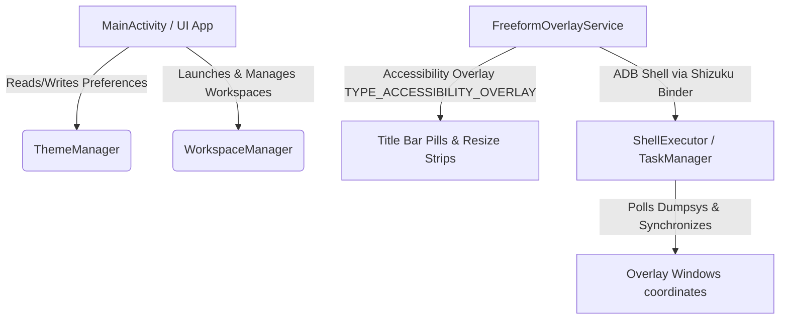

# FreeformShell v1.0.0 — Stable Release Documentation

Welcome to the stable release of **FreeformShell v1.0.0**! This documentation serves as a comprehensive guide to the architecture, features, and system customization options included in this milestone.

---

## 1. System Architecture Overview

FreeformShell transitions Android multitasking from standard phone configurations into a powerful desktop-grade environment. It manages Android's native hidden **Freeform Windowing Mode** using a performant service architecture:

*   **Shizuku Binder Service**: Executes high-privilege shell commands (resizing tasks, fetching active dumpsys, force-closing packages) securely without requiring root permissions.
*   **Accessibility Overlay Service**: Renders persistent, responsive visual frames and title bar pills directly above active freeform applications.

---

## 2. Core Feature Guides

### 🎛️ A. Custom Title Bars & Window Controls
*   **Dynamic Pill Styling**: The title bar pill extracts primary colors from the target application's icon, using HSL color normalization to deliver premium, harmonized branding.
*   **Adaptive Title Collapse**: Title pills dynamically scale down from `110dp` to `72dp` on phone screens to prevent UI clutter and keep content accessible.
*   **Force Close Button**: Red circular control (`#E81123`) that instantly terminates the package via shell activity tasks.

### 📐 B. Gesture Resize Strips (Edge Grabs)
*   **Multi-Axis Resize Zones**: Three transparent, highly responsive gesture strips are positioned at the left, right, and bottom edges of the active task bounds.
*   **Phone Sizing Limits**: Ensures small screen operations remain stable by enforcing hard minimum constraints:
    *   **Width**: `120dp` (coerced at most to `350px`).
    *   **Height**: `80dp` (coerced at most to `200px`).

### 🧲 C. Aero Snapping & Synced Layout Pairs
*   **Aero Snap Guides**: Renders a glowing translucent blue frame preview with `16dp` rounded corners during drag gestures, showing exact snapping zones before task execution.
*   **Paired Sync-Swap**: When two tasks are paired in split screen, changing one task's docked axis (e.g. swapping Left to Top) automatically reorganizes the adjacent task into the correct opposite slot (e.g. Right to Bottom) seamlessly.

### 📁 D. Workspace Management System (New in v1)
The Workspace Manager gives you total control over preserving and launching layouts:
*   **Save Current State**: Click `Save Layout to Favorites` on the home dashboard to store all open freeform tasks (their packages, components, target displays, and exact coordinate boxes).
*   **Interactive Bounds Editor**: Opens a gorgeous dialog listing all applications in the layout. You can:
    *   Individually modify `Left`, `Top`, `Right`, `Bottom` coordinates.
    *   Instantly remove specific apps from the workspace.
*   **Layout Promotion**: Easily promote any workspace from your scrollable **Workspace History** to become your main **Favorite Workspace**.
*   **Clean Deletion**: Fully erase favorite or history layouts from persistent SharedPreferences.

---

## 3. Settings & Preferences Reference

| Preference Key | Type | Description |
| :--- | :--- | :--- |
| `workspace_auto_snap` | Boolean | **True** (Default): Snaps launched workspace apps to saved bounds. **False**: Launches apps in default window sizes for manual arrangement. |
| `theme_mode` | Integer | System color appearance: `0` (Auto/System), `1` (Light Mode), `2` (Dark Mode). |
| `pill_auto_shrink` | Boolean | Enables title pills to scale down to a compact size when not actively interacted with. |
| `pill_inactive_scale` | Integer | Adjusts scale down percentage (30% to 90%) for compact mode per monitor. |
| `use_tablet_mode` | Boolean | Forces apps to render in responsive tablet UI modes by adjusting display density parameters. |

---

> [!IMPORTANT]
> **Android 12 Hover Fix**
> Jetpack Compose includes a framework-level bug on Android 12 where hovering mouse pointers over composite elements triggers `ACTION_HOVER_EXIT` loop crashes. FreeformShell implements a custom Looper Interceptor inside `MainActivity.kt` that silences these exceptions seamlessly, guaranteeing crash-free operations on all Android 12+ legacy tablets and phones.
